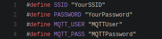

# Matrix-Voice-ESP32-MQTT-Audio-Streamer

The Audio Steamer is designed to work as an Snips Audio Server, see https://snips.ai/ and also support [Rhasppy](https://rhasspy.readthedocs.io/en/latest/)
Please raise an issue if some of the steps do not work or if they are unclear.

## Features

- Runs standalone, NO raspberry Pi is needed after flashing this program
- Ledring starts RED (no wifi connection), then turns BLUE (Idle mode, with wifi connection)
- Ledring turns GREEN when the hotword is detected, back to BLUE when going to idle
- Uses an asynchronous MQTT client for the playBytes topic
- Uses a synchronous MQTT client for the audiostream.
- OTA Updating
- Dynamic brightness and colors for idle, hotword, updating and disconnected
- Mute / unmute microphones via MQTT
- Reboot device by sending hashed password

## Required Hardware

Before getting started, let's review what you'll need.

- Raspberry Pi 3 (Recommended) or Pi 3 Model B+ (Supported).
- MATRIX Voice ESP32 version - Buy the MATRIX Voice.
- Micro-USB power adapter for Raspberry Pi
- Micro-SD Card (Minimum 8 GB)
- Micro-USB Cable
- A Personal Computer to SSH into your Raspberry Pi
- Internet connection (Ethernet or WiFi)

## Let's Get Started

If you are starting with a fresh install of Raspbian on your Raspberry Pi, follow this guide to set up your OS with the basic MATRIX device packages, as well as Snips.

## 1. Raspberry Pi Setup

Run the following commands inside your Raspberry Pi terminal to install the MATRIX Voice Software. This will keep the FPGA firmware updated and install few tools to flash the ESP-WROOM-32.

Add the MATRIX repository and key.

```
curl https://apt.matrix.one/doc/apt-key.gpg | sudo apt-key add -              
echo "deb https://apt.matrix.one/raspbian $(lsb_release -sc) main" | sudo tee /etc/apt/sources.list.d/matrixlabs.list              
```

Update your repository and packages.

```
sudo apt update              
sudo apt upgrade              
```

Install the MATRIX init package.

```
sudo apt install matrixio-creator-init              
```

Reboot your Raspberry Pi.

```
sudo reboot              
```

SSH back into the Pi, execute this command to enable ESP32 flashing.

```
sudo voice_esp32_enable              
```

Reset the ESP32 flash memory.

```
esptool.py --chip esp32 --port /dev/ttyS0 --baud 115200 --before default_reset --after hard_reset erase_flash            
```

## 2. Personal Computer and Arduino IDE Set Up

Follow the Personal Computer Setup & Installing Arduino IDE sections of [this guide](https://www.hackster.io/matrix-labs/program-over-the-air-on-esp32-matrix-voice-5e76bb#toc-personal-computer-setup-3) to set up the Espressif environment on your personal computer and configure your Arduino IDE for ESP32 programming.

## 3. Editing the Audio Streamer Code

Clone the Audio Streamer repository and enter into the relevant folder.

```
git clone https://github.com/Romkabouter/Matrix-Voice-ESP32-MQTT-Audio-Streamer  
cd Matrix-Voice-ESP32-MQTT-Audio-Streamer-arduino/MatrixVoiceAudioServer
```

First, download (git clone) the following libraries and move them to the `Arduino/libraries` folder. These libraries are used by the MatrixVoiceAudioServer.ino file.

- Matrix-Hal-ESP32 https://github.com/matrix-io/matrixio_hal_esp32 (copy over `matrixio_hal_esp32/components/hal` folder to `Arduino/libraries`)
- AsynchMqttClient https://github.com/marvinroger/async-mqtt-client
- AsyncTCP https://github.com/me-no-dev/AsyncTCP
- PubSubClient https://github.com/knolleary/pubsubclient. (Change the MQTT_MAX_PACKET_SIZE in PubSubClient.h to 2000)
- ArduinoJSON https://github.com/bblanchon/ArduinoJson

The MatrixVoiceAudioServer.ino file is the program that is going to run on the MATRIX Voice standalone. It will communicate with the Snips audio server on the Raspberry Pi and send data from the mics through MQTT. This way, the MATRIX Voice can run separate from the Pi and still serve as the input mics and you can place multiple MATRIX Voice satellite modules wherever you want as long as they share a WiFi connection with the Raspberry Pi server.

Open the MatrixVoiceAudioServer.ino file in the Arduino IDE.

Within the same directory as the MatrixVoiceAudioServer.ino, there will be a config.h file. This should open up in the Arduino IDE automatically as well. Change its contents according to the following guidelines.

- SSID to your WiFi's SSID
- PASSWORD to your WiFi's Password
- MQTT_USER to fit your needs (choose a unique username for each MATRIX Voice satellite that you deploy as MQTT audio streamers)
- MQTT_PASS to a password of your choice



Additionally, in the MatrixVoiceAudioServer.ino file, change 

- the MQTT_IP to the IP address of your Raspberry Pi
- MQTT_HOST to the IP of your Pi as well
- SITEID to fit your needs (choose a unique ID for each MATRIX Voice satellite, default is "matrixvoice")


You can also change the OTA host and passwordhash. These will be used if you try to upload code over the air- Arduino will prompt you for a password which is "voice" by default.


Feel free to edit or add on to the code. We're always happy to see new contributions! 

## 4. Compiling & Uploading the Code 

After making changes to the code, first compile the file to binary (Go to the Arduino IDE, then select "Sketch"->"Export Compiled Binary"). This will create a file called MatrixVoiceAudioServer.ino.esp32.bin. This is the file that will be flashed and should be in the same directory as the deploy_ota.sh file.

The repository has the firmware bin files and deploy_ota.sh file in the same directory, so to upload the default code, connect your MATRIX Voice to the Pi and run the command below. Remember to change the IP in deploy.sh to your PI's IP.

```
sh deploy_ota.sh   
```

You will be prompted to enter your Raspberry Pi's password. Once you enter it, you should see the message: "esptool.py wrapper for MATRIX Voice".

Watch how it flashes and when it restarts, the LED ring should turn blue. This means it has successfully connected to your WiFi.
  
Remove the MATRIX Voice from the Pi and plug the power into the MATRIX Voice with a micro-USB cable, the MATRIX Voice should start.

Close & restart the Arduino IDE. After about a minute, the Matrix Voice should show up as a network port ("Tools" -> "Port"). Select this port.


You can make changes to your code, and as long as you have the MATRIX Voice OTA methods, you can click on "Sketch" -> "Upload", and the code will upload over WiFi to your MATRIX Voice ESP32.

The first time you upload over the air, the Arduino IDE will prompt you for your password. This is "voice" by our default password hash.

> Note: OTA works roughly half the time with this code since it is fairly heavy so we recommend flashing through the Pi when possible.

## 5. Raspberry Pi Server Side Setup

For the Raspberry Pi server side setup, follow the steps mentioned [here](https://www.hackster.io/matrix-labs/matrix-voice-satellites-streaming-audio-to-pi-server-63b9cd#toc-5a---raspberry--pi-server-setup--w--matrix-device-8).
